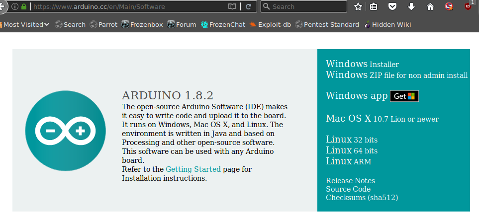
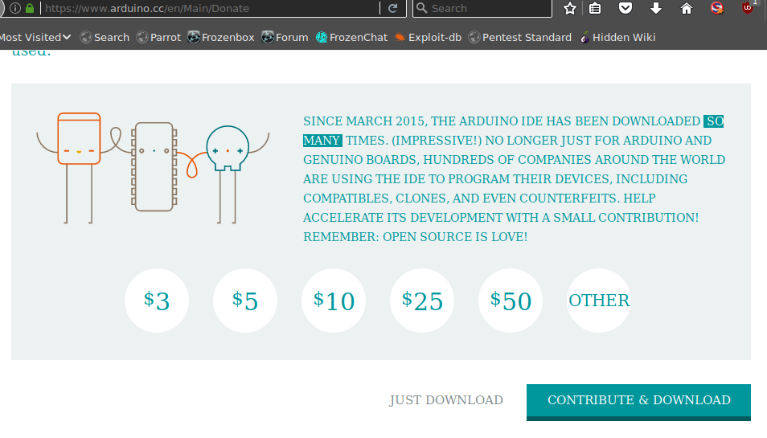
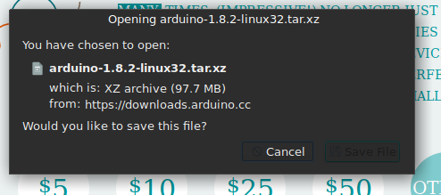
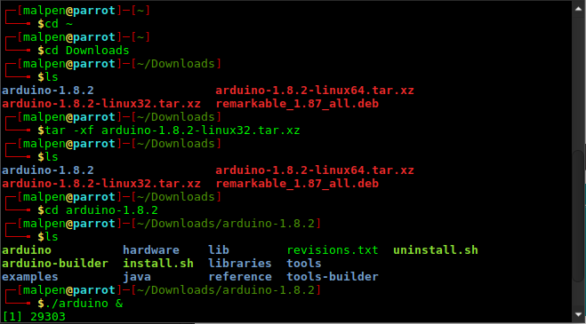
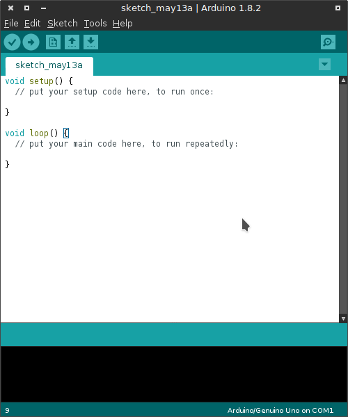
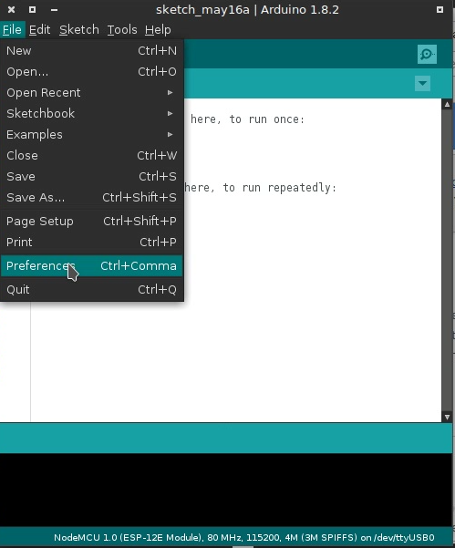
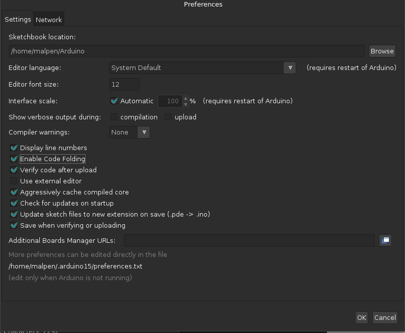
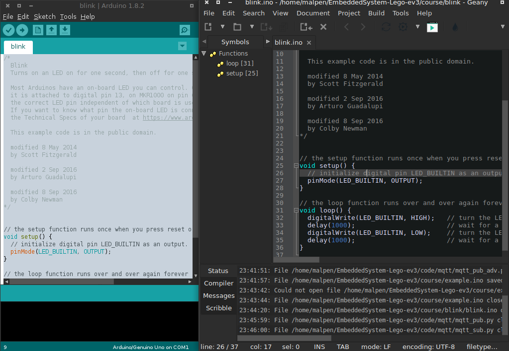

# Arduino

Arduino is an free software for electronics platform usually for MCU or SOC developemnet. 

## Installation

### Download arduino

DO :    Download Newest Version Arduino from Arduino official website
DON'T : Use apt-get install arduino # usually don't work

Arduino Official Website : https://www.arduino.cc/en/Main/Software
    
 

Seem we using ESP8266 develop board instead of Arduino board so Arduino don't earn any profit from us, please consided to donate to Arduino to thank for the great open soucres work.
    
 
 
 Assuem your follow the step of choose GNU/Linux distro image as using 32bit GNU/Linux OS. So pick the 32bits for download. If amd64 go for Linux 64bits, Linux 32bits on amd64 may not work in my experiences.
   
 

Go to the directory where  contain downloaded arduino file and extract the tar file then run in background.

    cd ~
    cd Downlaods
    tar -xvf arduino-1.8.2-linux32.tar.xz
    cd arduino-1.8.2
    ./arduino & 
    
  

A basic Arduino program consist two part, a `setup()` part usually for setup pin configuration, a `loop()` part is the main part to place the extractly running code, this `loop()` scope, code will repeat the to run.

 

---
    
### Arduino Custom Setup Hints

Option 1 : Enable the `Display line numbers` and `Enable Code Folding` in `File` -> `Preferences` could give you better visiual feel when coding.

 

 

 

---

Option 2 : Enable the `Use external editor` to use any editor you want

use geany as a external editor, the arduino will sync the content while change and save in geany. Keep arduino running need the `Verify` and `Upload` functionality.

 

---

### Configure Arduino

    File->Preferences->Additional Boards Manager URLs->

    Copy and Paste the follow link->OK
   
    http://arduino.esp8266.com/stable/package_esp8266com_index.json

    Sketch->Include Library->Manager Libraries

    Wait for the udpate finish(the bar at bottom)

    https://github.com/esp8266/Arduino
    > Boards manager link: http://arduino.esp8266.com/stable/package_esp8266com_index.json

---

### trobuleshooting

If your using other GNU/Linux distro except of Debian and already installed with Arduino but the pre-installed one is fail to run. Try remove /usr/bin/arduino and create a new soft link in /usr/bin/ name arduino
    
use `which` to find where the `ardino` local at, usr `rm -rf` delete the old `arduino` binary file, `ln -s` create soft link to in /usr/bin as 

    which arduino
    /usr/bin/arduino

    sudo rm -rf /usr/bin/arduino
    sudo ln -s ~/Download/Arduino1.8.2/arduino /usr/bin/arduino
    
    
   >  The preinstalled arduino in my parrot with Thinkpad X61s make my window x crash = =, so I remove the /usr/bin/arduino then create a soft link to the downloaded arduino 
