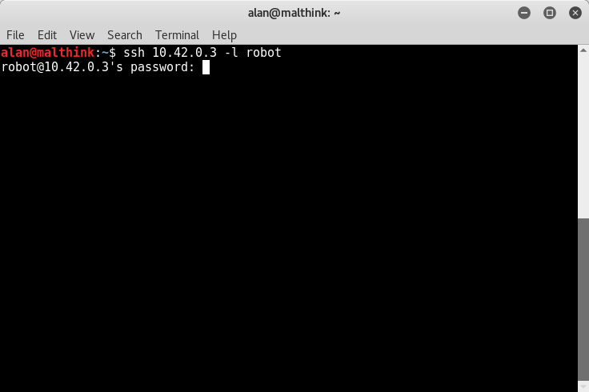
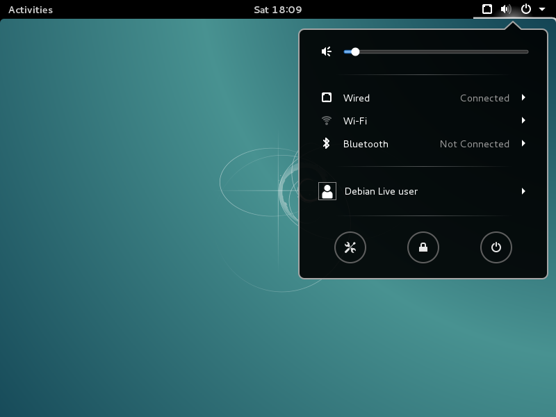
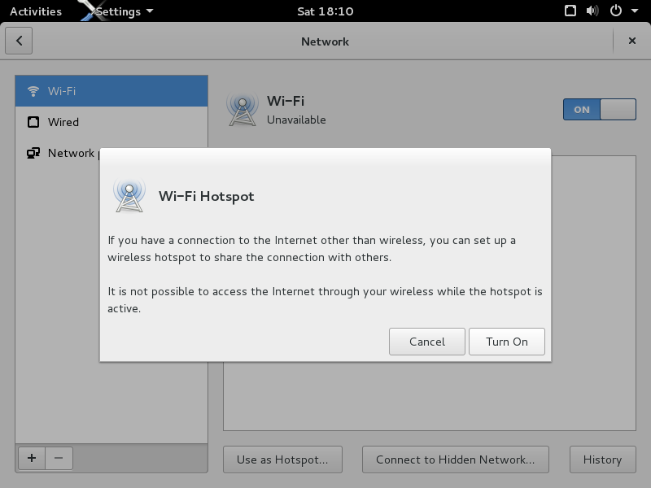
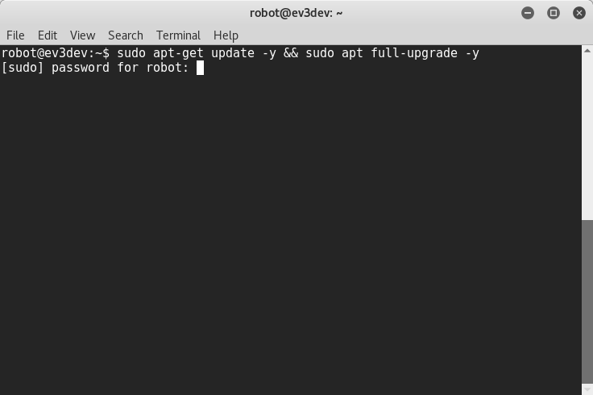

<!-- for remarkable -->
<link rel="stylesheet" type="text/css" href="../../style.css">

 
# hello world ev3dev

hello

## connect ev3 via usb

connect computer to Lego ev3 via USB cable

1). open terminal, type the follow command

     sudo ifconfig usb0 10.42.0.1
     
troubleshooting, type `sudo ifconfig` to see either `usb0`, `usb1` exist or not

2). use ssh to access ev3dev, default username is robot, password is maker

     ssh 10.42.0.3 -l robot

 

 

## ev3dev connect to the Internet via usb

`code/ev3dev-connecting-to-the-internet/via-usb.sh`

1). create a empty file call `via-usb.sh` in code user code direcotry

    cd ~
    mkdir code
    cd code
    touch via-usb.sh
    
use geany IDE to edit via-usb.sh
    
    geany via-usb.sh
    
type the follow code in the file, `CRTL+S` to save the content, `ALT+F4` to quit geany.

---

==for case don't have geany==

use vi RAW IDE to edit via-usb.sh

    vi via-usb.sh
   
type the follow code in the file, `shirt+i` to start typing, `shirt+;` to enter command mode, type `:wq` to write and quit.

---

caution: if computer access Internet via WiFi, change eth0 to wlan0 in line 3.
    
    #!/bin/sh
    ifconfig usb0 10.42.0.1
    iptables --table nat --append POSTROUTING --out-interface eth0 -j MASQUERADE
    iptables --append FORWARD --in-interface usb0 -j ACCEPT
    echo 1 > /proc/sys/net/ipv4/ip_forward
    
gain execute pressmission to the via-usb.sh 

    chmod +x via-sub.sh
    
execute the via-usb.sh with priilage right

    sudo ./via-sub.sh

## ev3dev connecting to the Internet via WiFi adapter

code/ev3dev-connecting-to-the-internet/via-wifi-adapter

// TODO

1). attach WiFi adapter to ev3-brick USB port, using the ev3dev brick menu config wireless connection

### use wifi router

something you already know

### use mobile hotspot

just press the hotspot sign to enable it

### use network manager

 

 

 

 

 

// TODO

take photo of setup wifi connect via brick gui interface

## ssh

username : robot
password : maker

     ssh 10.42.0.3 -l robot
   
 

 

     
## update ev3dev

switch user to root

     sudo su 
     apt-get udpate -y & apt full-upgrade -y
     
 

 

## hello world

     echo "hello world"
     especk "hello world" --stdout | aplay
---

last moditify : Sunday, 07. May 2017 01:50AM 

