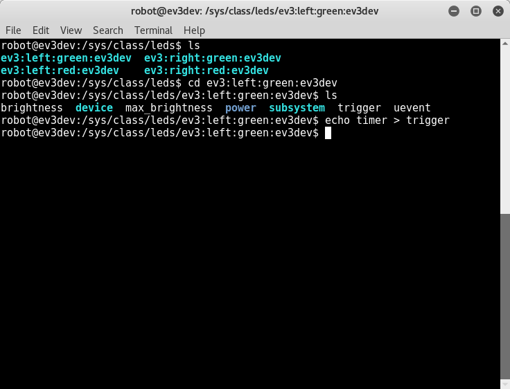
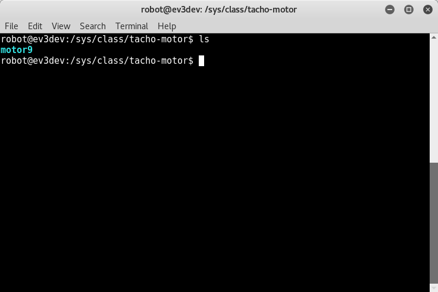
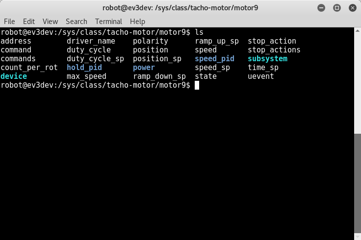
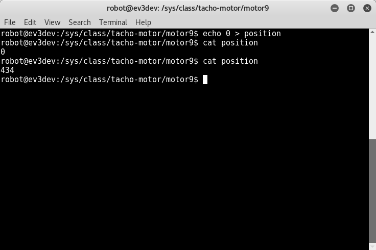
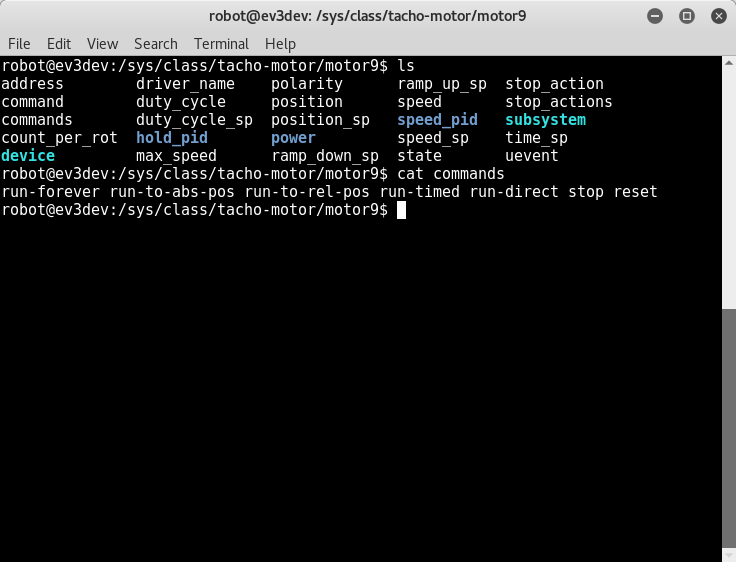
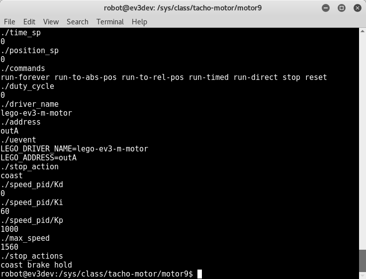

# sysfs continue

# sysfs extra

assume after reading of `sysfs.md 

---

### power supply

 

 

---

### blink led by trigger

set time as trigger to led

 

set no trigger to led

 

###  tacho metor

current attach 1 motor

 

attach few more

 

 

reset position, scoll the motor and cat the position 

 

 

 

reset motor by command

 

### lego sensor

---
Saturday, 06. May 2017 05:42PM 
