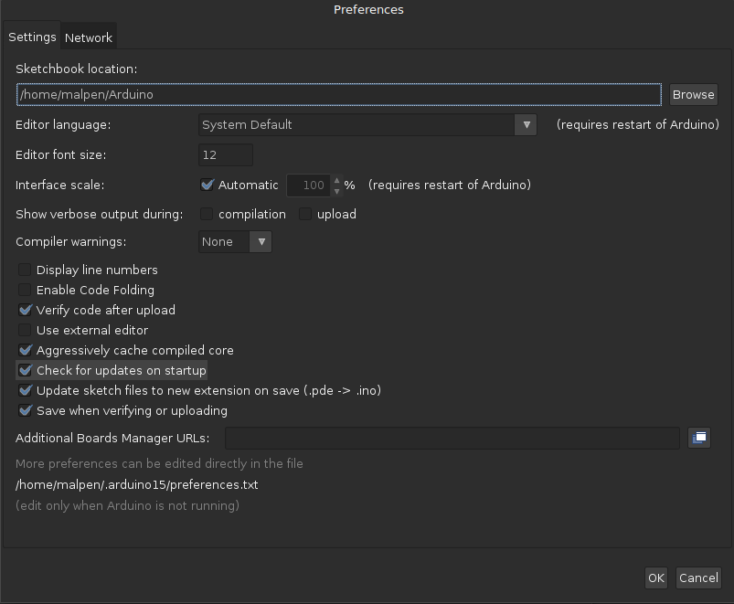
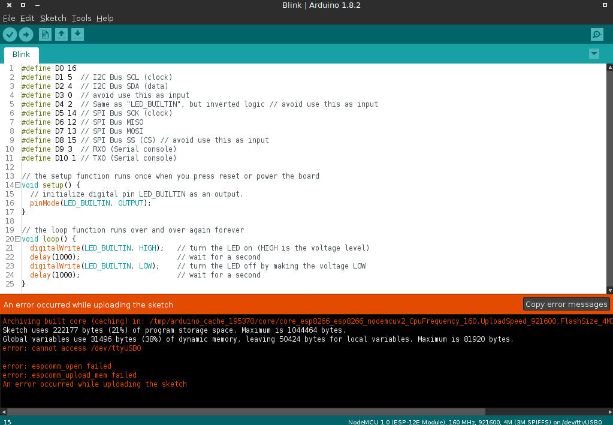

# esp8266

ESP8266 is a low cost WiFi embedded soc chip. Which have better preference than usual Arduino Amtel328P MCU and with addiition WiFi function.

Use NodeMcu v1.0(12E) develop board as serial communication practice for eve3dev.

## prepare

[./course/arduino.md](./arduino.md) 

***
    
### Configure Arduino

`File`->`Preferences`->`Additional Boards Manager URLs`->

Copy and Paste the follow link->`OK`
   
http://arduino.esp8266.com/stable/package_esp8266com_index.json

 

 

 

`Sketch`->`Include Library`->`Manager Libraries`

 

Wait for the udpate finish(the bar at bottom)

	seach esp8266, install the esp8266 for communitry

 

***

#### did not found esp8266 in Manager Librariesb

Download esp8266 arduino package and place in correct directory

    cd ~/Downloads/arduino-1.8.2/hardware # or ~/Arduino/hardware
    mkdir esp8266com
    cd esp8266com
    git clone https://github.com/esp8266/Arduino.git esp8266
    
    cd esp8266/tools
    python get.py
    
 
    
Restart Arduino

***

#### select nodemcu in arduino

To upload the binary code into esp8266, need to confige the correct `Board` and `Port` for esp8266 develop board

`Tools` -> `Board` -> `NodeMcu 1.0 (ESP-12E Module)`

 

`Tools` -> `Port` -> `/dev/ttyUSB0`

 

***

### coding

hardware : esp8266 develop board
additonal hardward : dht sensor

A simple arduino program genratea random temperture and hudmidty value and use serial communcaition to send back to ev3dev. In ev3dev use a python program to read the serial string and show the temperrue and humdity on the Lego ev3 brick screen

### Tips : nodemcu pin reference to esp8266 gpio
 
method 1 : use static const
 
igrr commented Jul 22, 2015 @ https://github.com/esp8266/Arduino/issues/584

    static const uint8_t D0   = 16;
    static const uint8_t D1   = 5;
    static const uint8_t D2   = 4;
    static const uint8_t D3   = 0;
    static const uint8_t D4   = 2;
    static const uint8_t D5   = 14;
    static const uint8_t D6   = 12;
    static const uint8_t D7   = 13;
    static const uint8_t D8   = 15;
    static const uint8_t D9   = 3;
    static const uint8_t D10  = 1;

    
method 2: use define header

randmor commented Apr 13, 2016 @ https://github.com/esp8266/Arduino/issues/584

    #define D0 16
    #define D1 5   // I2C Bus SCL (clock)
    #define D2 4   // I2C Bus SDA (data)
    #define D3 0
    #define D4 2   // Same as "LED_BUILTIN", but inverted logic
    #define D5 14 // SPI Bus SCK (clock)
    #define D6 12 // SPI Bus MISO 
    #define D7 13 // SPI Bus MOSI
    #define D8 15 // SPI Bus SS (CS)
    #define D9 3  // RX0 (Serial console)
    #define D10 1 // TX0 (Serial console)

***

### troubleshooting

Avoid using GPIO0:D3 GPIO2:D4 GPIO15:D8

***

Board Manager fail for install esp8266

Solution : make sure you have access to Internet

***

Git version

    cp -R ~/Downloads/arduino-1.8.2/hardware/esp8266com ~/Arduino/hardware/

***

Pressmisson problem as upload code into esp8266

 

    user=`whoami`
    cd /dev
    ls tty*
    sudo chown $user ttyUSB0 # 

 

### Reference Link

https://github.com/esp8266/Arduino/README.md
https://github.com/esp8266/Arduino/issues/584

***

### Useful Link

	
