# To create bootable Linux USB

The hardware you need descript in `hardware/hardware.md`.

## The software you need

Rufus

`rufus-2.14.exe`  in https://rufus.akeo.ie/

## The Linux image you need

**Option 1 : Debian Live CD**

no install require

`debian-live-8.7.1-i386-gnome-desktop.iso`  in http://cdimage.debian.org/debian-cd/current-live/i386/iso-hybrid/ 

**Option 2 : Debian installer image**

install required, if you wanna install into the computer

`debian-8.7.1-i386-DVD-1.iso` in http://cdimage.debian.org/debian-cd/current-live/i386/iso-hybrid/ 
## Step flow

### Demo of usb boot

Bootable USB ==only avaiable in bios is not lock==

#### Bios no boot menu option

This modifity could keep the already exist boot method avaiable, no bad affect of load into origianl OS

enable the bios ACPI or UFEI option to make USB boot available 

1). Enter `Power`,Change `ACPI 2.0 Support` to `Enabled`
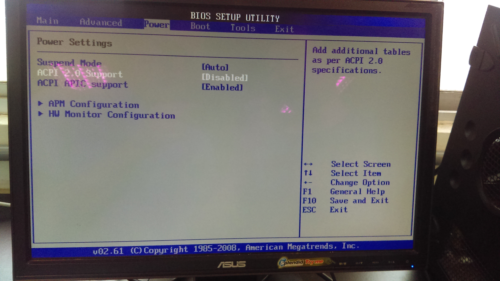 

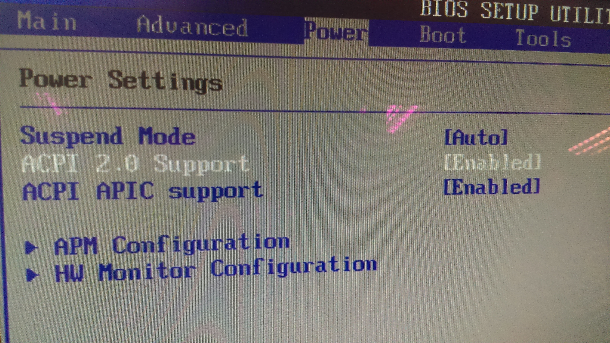 

2). Enter `Boot`, Select `Hard Disk Drivers`, Change `USB:xxxx` device in `1st Drive` by clicking `+`

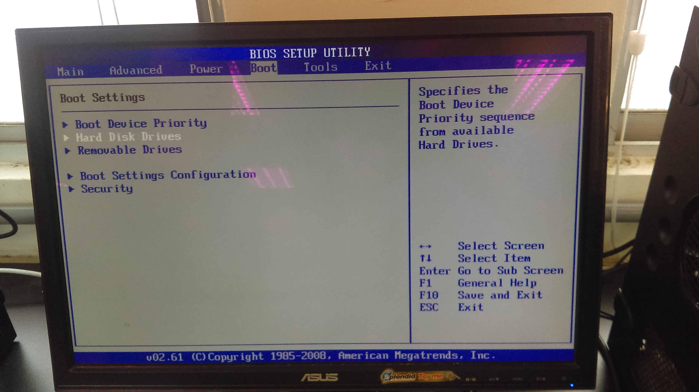 

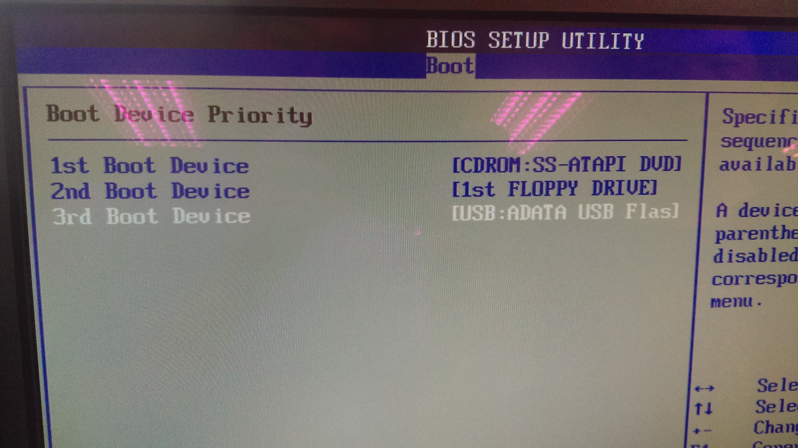 

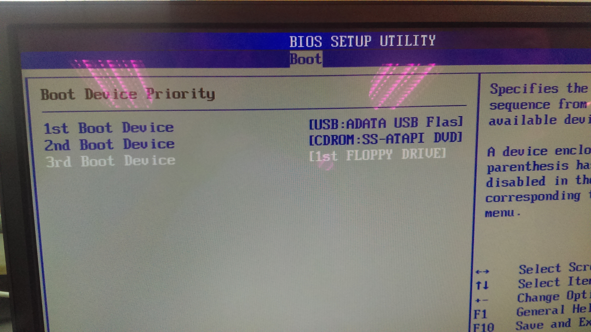 

3). Select `Boot Device Priority`,Change `USB: xxxx` device in `1st Boot Device`

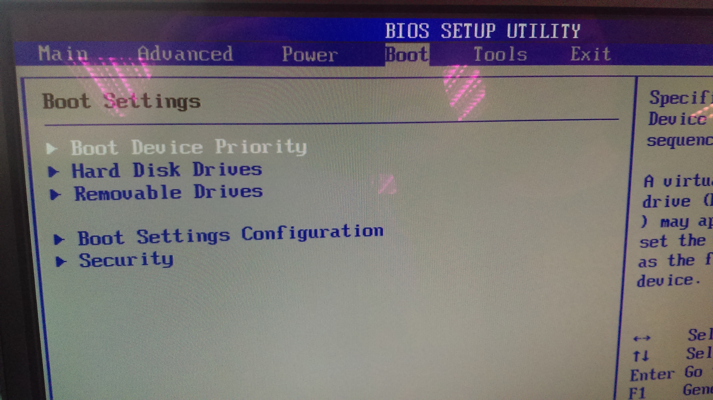 

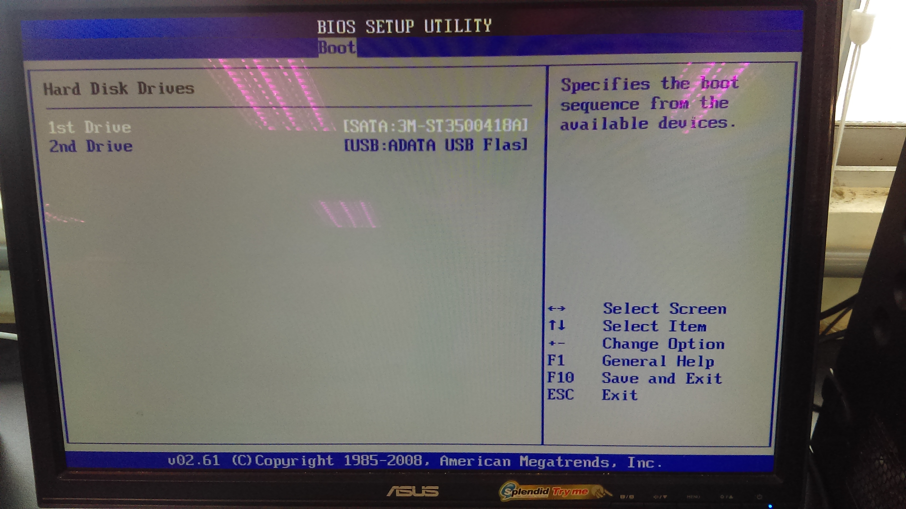 

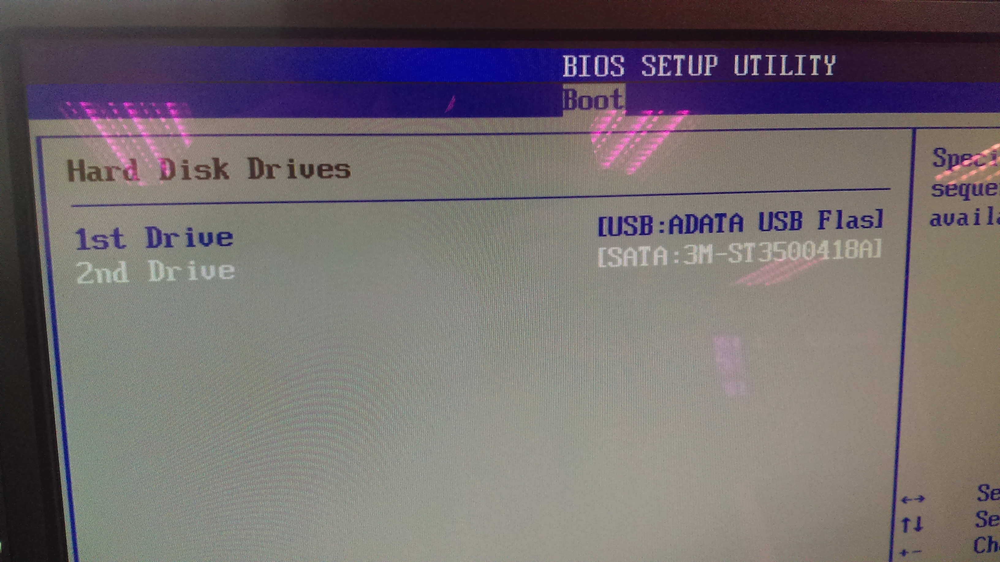 

---

2). Enter `Exit`, Select `Exit & Save Changes`
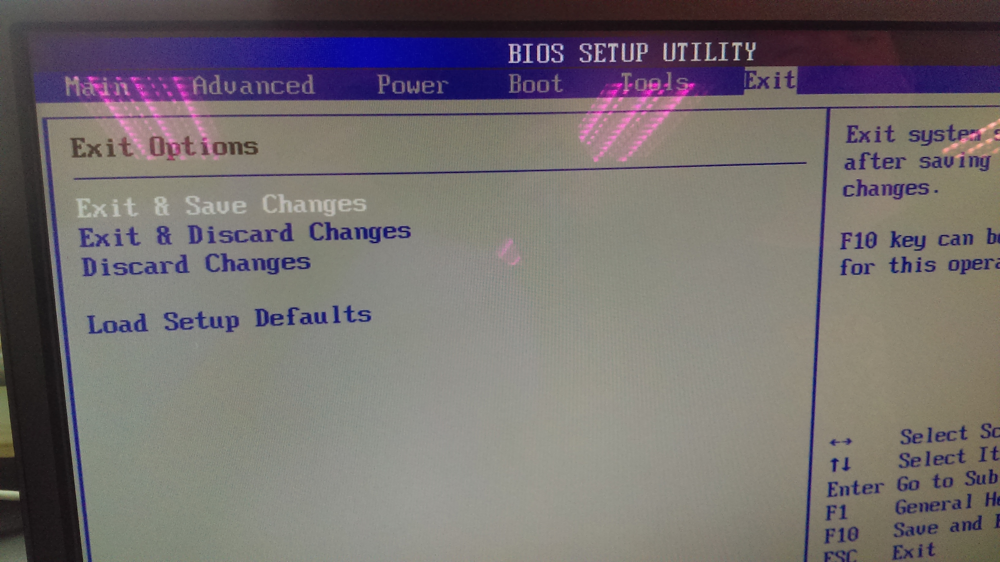 

---

3). ==`Reboot` your computer== by press the reboot button at the PC front panel

---

4). auto load into Linux Live CD(USB), in this case is showing parrot boot menu
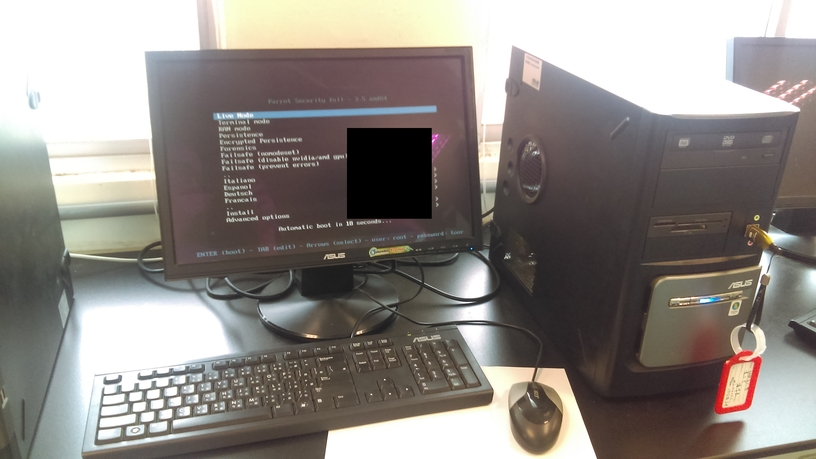 

#### Bios with boot menu option

1). The `boot menu`option is always at `F12` at bios loading screen
Press `F12` to enter boot menu

2). Select the proper device that you have burn Debian Live CD
In most of case something like `USB: your usb device band name` 

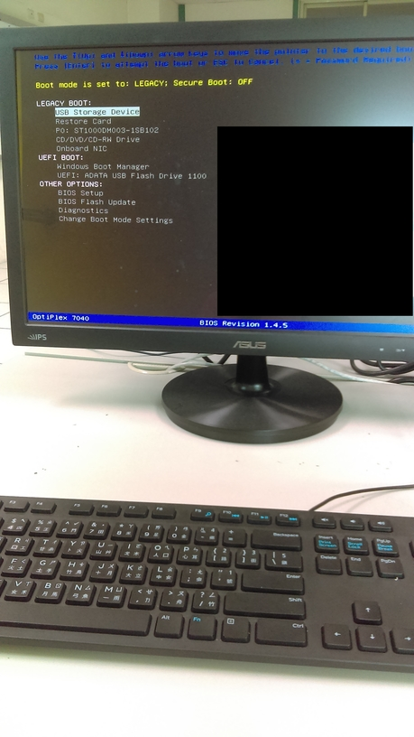 

for some modem gui bios, you need to enter bios setup then enter boot menu

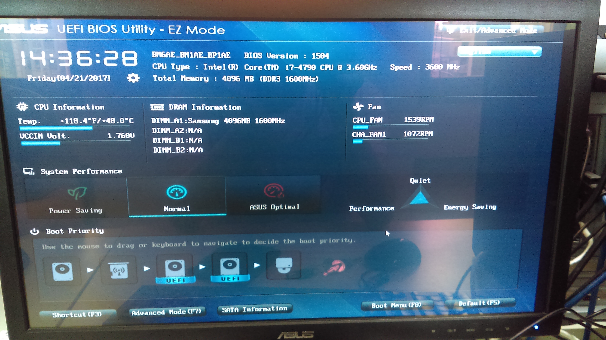 

