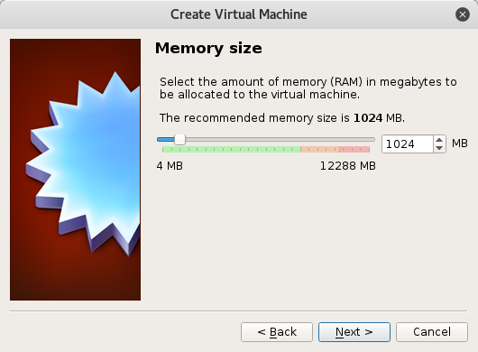

# Operate System

In this section,  memtion about the OS use in this course.

## Prepare OS
---

### Chosing GNU/Linux distros
---

<!--
In this course will be using `linuxminit-18.1-cinamon-32bit.iso`

Downlaod `linuxminit-18.1-cinamon-32bit.iso` in https://www.linuxmint.com/edition.php?id=226 , in the `Download mirrors` section select `COUNTRY` `World` `MIRROR` `EvoWise CDN` will be fine.
-->

Download Debian== Live CD ==`debian-live-8.7.1-i386-gnome-desktop.iso`  in http://cdimage.debian.org/debian-cd/current-live/i386/iso-hybrid/ 

<!--
==If you wanna to install Debian== in the computer you can download install image in http://cdimage.debian.org/debian-cd/current/ , image in `amd64` is for 64bit(x86_64) machine, iamge in `i386` is for 32bit(x86) machine which for old computer. 
-->

The release version may not same when your download but that is ok.

### Prepare ev3dev
---

Download `ev3dev-jessie-ev3-generic-2017-02-11.zip` in http://www.ev3dev.org/downloads/ by clicking LEGO MINDSTORMS EV3 section ` Download for EV3(211MiB)`

The release version may not same when your download but that is ok.

### Prepare Rufus

Download create bootable USB drives software  `rufus-2.14.exe`  in https://rufus.akeo.ie/  `Download` section, ` Rufus 2.14`  or ` Rufus 2.14 Portable`  both is ok.

The release version may not same when your download but that is ok.

### Demo 
Here is snapshot of demo of prepare these OS

The hardware you need descript in `hardware/hardware.md`.

Select the one you need

1. [Demo of virtualbox](#demo-of-virtualbox)

2. [Demo of usb boot](#demo-of-usb-boot)

#### Demo of virtualbox

<!--
> For the tutor who use VirtualBox to run Linuxmint Live CD, in Create Virtual Machine step, version use Ubuntu (64-bit) or Ubuntu (32-bit), other may not work.
-->

==please ignore that I using VMware to run windwos 7 for demo==

1). Download VirtualBox  `Windows hosts ` in https://www.virtualbox.org/wiki/Downloads

 

---

2). Install into your USB Memory Stick.

---

3). Move the install execute file into USB Memory Stick Storage as assume may need to re-install after the computer OS recovered

---

4). Run VirtualBox
 

---

5). Click `File` -> `Preferences`, change `Default Machine Folder:`  into your USB Memory Stick. Press OK after finish

 

---

6). Create Virtual Machine by clicking `New` at the main page.

 

---

7). Enter the Name of the Virtual Machine and Select the `Type` to `Linux` and `Version` as `Debian (32-bit)` for `debian-live-8.7.1-i386-gnome-desktop.iso`  

 

---

8). Select the Memory size for Virtual Machine use the `default` setting is ok

 

---

9). Select the `default`  setting of `Create a virtual hard disk now` if you wanna install the OS or have stroage, select `Do not add a virtual hard disk`  if you wanna only wanna use a live CD GNU/Linux

 

---
For Selected `Create a virtual hard disk now` in step 9, continue on step 10 to 12
For Selected `Do not add a virtual hard disk` in step 9, skip step 10 to 12

10). Select `VDI (VirutalBox Disk Image)`

 

11). Select proper `File location` and `size`, as your have done step 5, the `File location` should already alocate at your USE Memory Stick. Depend your USB Memory Stick size select the approach size as your wanna. 
16GB USB select 8GB as hard disk is ok. 
8GB USB select 4GB is fine.

 

12). Select `Dynamically allocated`

 

---

13). `debian 32-bit` created

 

---

14). Select `File` -> `Settings` -> `Empty`(The DVD icon) -> `DVD icon`(the right size of Optical Drive:) -> `Choose Virtual Optical Disk File...` -> select `debian-live-8.7.1-i386-gnome-desktop.iso` -> Then press `OK`

 

---

15). Back to main page, click `START`
> You should see `Storage` -> `IDE Secondary Master:` is relate to the iamge your selected in step 14

 

---

16). Debian is running, select `Live (586)`. 
If you want install the debian in your computer or virutal harddisk, select `Install`. The `install` demo won't include in this course's material

The ==scape button== of Virutal Box is show ==at the right conner== which is ==Right Ctrl== in this case

 

---

17). Select `Capture` if you see this information

 

---

18). Loaded into Debian

 

---

19). Open terminal, click `activities` or press `super` then type `terminal`, open the `terminal`

 

---

20). The `terminal` is all your in need this course

 

---

---

## Useful Link
---
GNU : Explaining Why We Don't Endorse Other Systems
https://www.gnu.org/distros/common-distros.en.html

Wikipedia : List of LInux distributions
https://en.wikipedia.org/wiki/List_of_Linux_distributions
